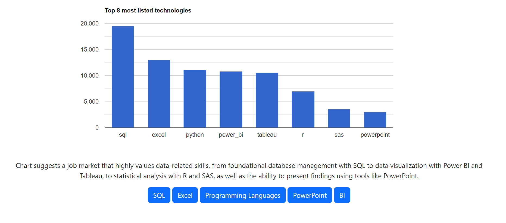
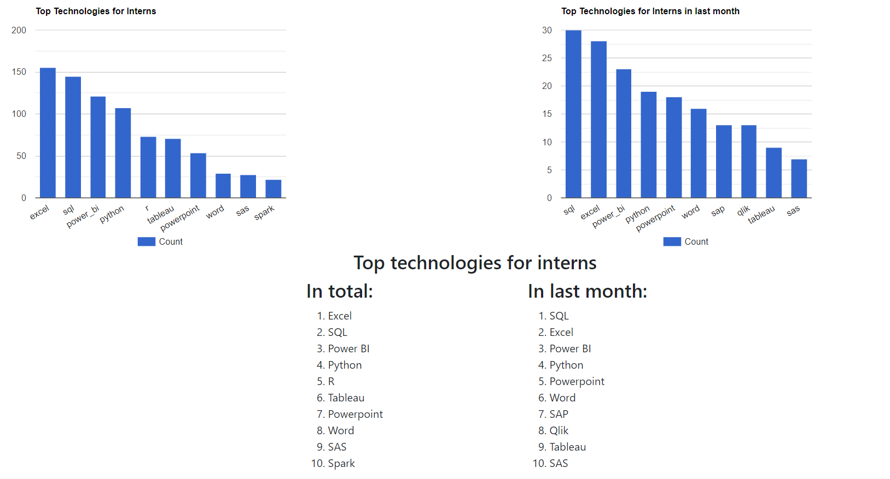
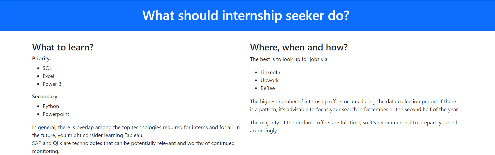

# Intern Skills For Data Analyst
The Data Analyst Internship Insights Project is an initiative aimed at helping students and aspiring data analysts land their first job as data analyst interns. In today's competitive job market, understanding the intricacies of job listings and knowing what employers are looking for is crucial. This project leverages data analysis techniques and the power of data visualization to provide valuable insights into job listings for data analyst positions.

Using Jupyter Notebook for data analysis and the Django framework for web development, this project processes job listings data. It then extracts meaningful patterns, trends, and key qualifications sought by employers in data analyst interns. The findings are presented through an informative web application, making it easy for students to access and apply this valuable information to their job search efforts.

## Table of Contents

1. [Screenshots](#screenshots)
2. [Technologies Used](#technologies)
3. [Installation](#installation)
4. [Project Status](#status)
5. [Future Plans](#plans)

## Screenshots
Here are some example screenshots from the completed project:

## Technologies Used

- **Programming Languages:** Python, JavaScript.

- **Web Framework:** Django.

- **Frontend Technologies:** Google Charts, Bootstrap.

- **Data Analysis Tools:** Jupyter Notebook, pandas, NumPy.

- **Data Visualization:** Matplotlib, Seaborn.

- **Version Control:** Git.

- **Development Tools:** Pycharm and Visual Studio Code.

## Instalation

Since the CSV file is quite large, to test the project's functionality, you will need to download it from the following link:

[Link to dataset](https://www.kaggle.com/datasets/lukebarousse/data-analyst-job-postings-google-search)

This way, you can ensure that the project works as expected by using the provided data for testing purposes.

## Project Status
This project has been successfully completed.

## Future Plans
I plan to create more projects like this one and bring them together into a single interactive webpage.

[TOP](#top)
